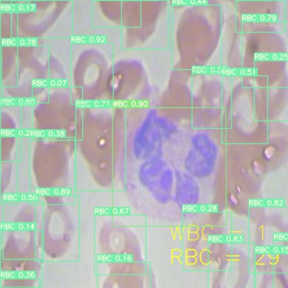
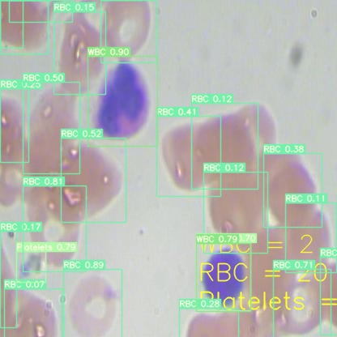
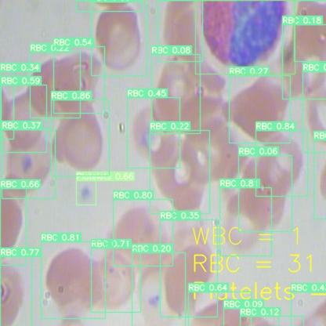
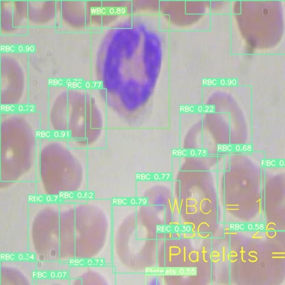
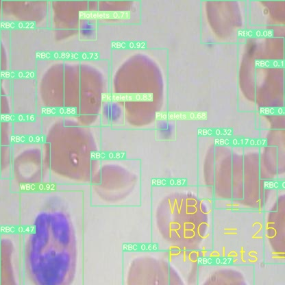

# Complete-Blood-Count-CBC-
Complete Blood  Cells Detection and Counting
#Transfer Learning and Custom Training for CBC on Official YOLOv7

## Results
``` shell
  Class      Images      Labels           P           R      mAP@.5  mAP@.5:.95: 100% 2/2 [00:02<00:00,  1.30s/it]
     all          73         967       0.852       0.876       0.906        0.61
     Platelets    73          76       0.802       0.855       0.876       0.436
     RBC          73         819       0.789       0.772       0.859         0.6
     WBC          73          72       0.966           1       0.983       0.792
50 epochs completed in 0.377 hours.
```
## Inference

On image:
``` shell
!python detectandcount.py --weights best.pt --conf 0.06 --img-size 416 --source  /inference/images

```

<div align="center">
    <a href="./">
        
    </a>
</div>

<div align="center">
    <a href="./">
        
    </a>
</div>
<div align="center">
    <a href="./">
        
    </a>
</div>
<div align="center">
    <a href="./">
        
    </a>
</div>
<div align="center">
    <a href="./">
        
    </a>
</div>

## Reference/Citation

```
@article{wang2022yolov7,
  title={{YOLOv7}: Trainable bag-of-freebies sets new state-of-the-art for real-time object detectors},
  author={Wang, Chien-Yao and Bochkovskiy, Alexey and Liao, Hong-Yuan Mark},
  journal={arXiv preprint arXiv:2207.02696},
  year={2022}
}
```


## Acknowledgements

<details><summary> <b>Expand</b> </summary>

* [https://github.com/WongKinYiu/yolov7](https://github.com/WongKinYiu/yolov7)
</details>
